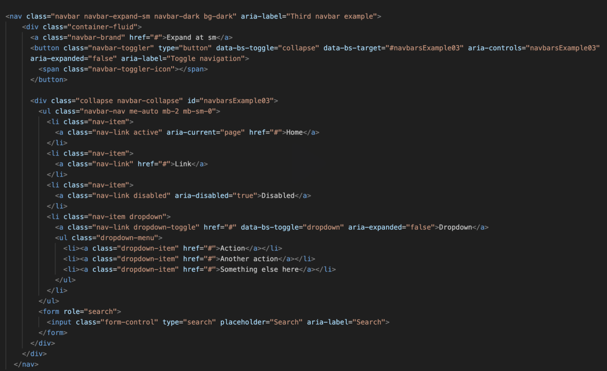
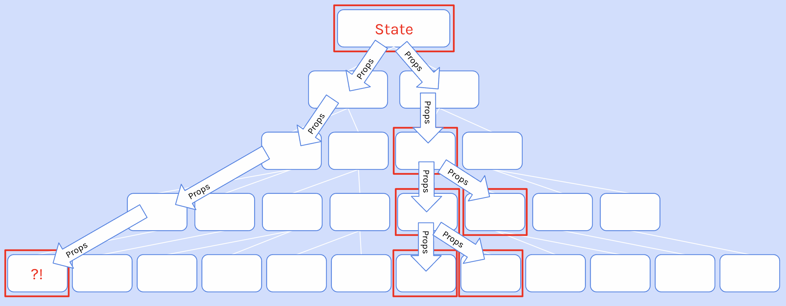

<div align='center'>
  
  <h1>Repaso para entrevista React Junior! 🤓</h1>

<i>45 preguntas con respuestas para que repases antes de tus entrevistas</i>

<sup>Dame una :star: si te sirvió ❤️</sup>

</div>

--- 
> *Las respuestas a las preguntas vienen principalmente de [scrimba](scrimba.com) y algunas respuestas inspiradas en [preguntas-entrevista-react](https://github.com/midudev/preguntas-entrevista-react) de [midudev](https://github.com/midudev/preguntas-entrevista-react/commits?author=midudev), gracias!*

---

## Índice

- [Índice](#índice)
  - [¿Qué es React?](#qué-es-react)
  - [¿Por qué usar React?](#por-qué-usar-react)
  - [¿Por qué es Composable?](#por-qué-es-composable)
  - [¿Por qué es Declarativo?](#por-qué-es-declarativo)
  - [¿Qué es un Componente?](#qué-es-un-componente)
  - [¿Qué es JSX?](#qué-es-jsx)
  - [¿Cómo se transforma el JSX?](#cómo-se-transforma-el-jsx)
  - [Diferencia entre componente y elemento en React](#diferencia-entre-componente-y-elemento-en-react)
  - [¿Cómo crear un componente en React?](#cómo-crear-un-componente-en-react)
  - [¿Qué son las props en React?](#qué-son-las-props-en-react)
  - [Prop children en React](#prop-children-en-react)
  - [¿Qué es un State en React?](#qué-es-un-state-en-react)
  - [¿Cuál es la diferencia entre Props y State?](#cuál-es-la-diferencia-entre-props-y-state)
  - [¿Cómo es el proceso de un State en React?](#cómo-es-el-proceso-de-un-state-en-react)
  - [¿Qué es el Conditional Rendering o Renderizado Condicional en React?](#qué-es-el-conditional-rendering-o-renderizado-condicional-en-react)
  - [¿Cómo agregar clases a un componente en React?](#cómo-agregar-clases-a-un-componente-en-react)
  - [Agregar clases a un componente de Forma condicional](#agregar-clases-a-un-componente-de-forma-condicional)
  - [¿Cómo aplicar estilos (CSS) en React?](#cómo-aplicar-estilos-css-en-react)
  - [¿Cómo se renderiza un array en React?](#cómo-se-renderiza-un-array-en-react)
  - [¿Cómo funcionan los event listeners en React?](#cómo-funcionan-los-event-listener-en-react)
  - [¿Qué son los Hooks en React?](#qué-son-los-hooks-en-react)
  - [¿Cómo funciona `useState`?](#cómo-funciona-useState)
  - [¿Cómo se modifica el state de un array?](#cómo-se-modifica-el-state-de-un-array)
  - [¿Cómo se modifica el state de un objeto?](#cómo-se-modifica-el-state-de-un-objeto)
  - [Valor inicial del state es una función](#valor-del-state-es-una-función)
  - [¿Cómo se pasan States entre diferentes componentes?](#cómo-se-pasan-states-entre-diferentes-componentes)
  - [¿Qué es `useEffect`?](#qué-es-useEffect)
  - [¿Cuándo NO usar `useEffect`?](#cuándo-no-usar-useEffect)
  - [¿Qué es una Clean Up Function?](#qué-es-una-clean-up-function)
  - [¿Cómo podemos ejecutar código cuando el componente se renderiza?](#cómo-podemos-ejecutar-código-cuando-el-componente-se-renderiza)
  - [¿Qué es Fragment?](#qué-es-fragment)
  - [¿Cómo se recomienda utilizar imagenes en React?](#cómo-se-recomienda-utilizar-imagenes-en-react)
  - [¿Para qué se utiliza el hook `useRef`?](#para-qué-se-utiliza-el-hook-useRef)
  - [¿Cuál es la relación entre `useEffect` y `useRef`?](#cuál-es-la-relación-entre-useEffect-y-useRef)
  - [¿Cómo inicializar un proyecto de React?](#cómo-inicializar-un-proyecto-de-react)
  - [¿Cómo funcionan los Forms en React?](#cómo-funcionan-los-forms-en-react)
  - [¿Cómo funicionan los Forms en React 18?](#cómo-funcionan-los-forms-en-react-18)
  - [¿Cómo funicionan los Forms en React 19?](#cómo-funcionan-los-forms-en-react-19)
  - [¿Qué es React DOM?](#qué-es-react-dom)
  - [¿Cuáles son las 3 fases del renderizado en React?](#cuáles-son-las-3-fases-del-renderizado-en-react)
  - [¿Qué es un Overloaded Component?](#qué-es-un-overloaded-component)
  - [¿Qué es Props Drilling?](#qué-es-prop-drilling)
  - [¿Qué soluciones existen para el Props Drilling?](#qué-soluciones-existen-para-el-props-drilling)
  - [¿Qué es React Context?](#qué-es-react-context)
  - [¿Qué es Compound Component?](#qué-es-compound-component)
  - 

---

## ¿Qué es React?

**React es una biblioteca de JavaScript de código abierto para construir interfaces de usuario.** Está basada en la componetización de la UI: la interfaz se divide en componentes independientes, que contienen su propio estado. Cuando el estado de un componente cambia, React vuelve a renderizar la interfaz.

Esto hace que React sea una herramienta muy útil para construir interfaces complejas, ya que permite dividir la interfaz en piezas más pequeñas y reutilizables.

---

## ¿Por qué usar React?

1. Es **composable** (componible)
2. Es **declarativo**.

---

## ¿Por qué es Composable?

> Porque puede crear piezas reusables e intercambiables de la web fácilmente, que pueden ser combinadas en varias formas para crear sistemas complejos.
> 

Por ejemplo, este es un nav creado con Boostrap para una web.



Si la web tiene distintas páginas que utilizan el mismo nav, entonces debemos copiarlo y pegarlo en cada una de ellas, y si quiero modificar algo, debo hacerlo en todas y cada una de ellas.

Con los **react components**, puedo crear un componente y llamarlo en las distintos HTML, y nos queda algo del siguiente estilo:

```jsx
<body>
	<MyCustomNavbar />
	<MainContent />
	<MyCustomFooter />
</body>
```

Ahora, cada vez que quiera usar el nav bar en mis documentos, puedo renderizar el React component de esa forma, y obtengo todo lo que viene de la mano de ese componente, en este caso el código que vimos arriba.

---

## ¿Por qué es Declarativo?

> Significa que no se especifica cómo se debe realizar una tarea, sino qué se debe realizar. Esto hace que el código sea más fácil de entender y de mantener.
> 
> 
> Podemos apoyarnos en React para manejar tareas manuales y tediosas de las que de otra manera tendríamos que preocuparnos nosotros mismos.
> 

Una buena forma de entenderlo, es sabiendo que significa su opuesto.

**Declarativo:**

```jsx
root.render(
	<h1>Hello, React!</h1>
)
```

**Imperativo:**

```jsx
const h1 = document.createElement('h1')
h1.classList.add('header')
h1.textContent = 'Hello, Vanilla JS!'
document.getElementById('root').appendChild(h1)
```

Por lo tanto, no le decimos cómo debe renderizar la interfaz a base de instrucciones. Le decimos qué debe renderizar y React se encarga de renderizarlo.

---

## ¿Qué es un Componente?

Un componente es una pieza de código que renderiza una parte de la interfaz. Los componentes pueden ser parametrizados, reutilizados y pueden contener su propio estado.

En React los componentes se crean usando funciones o clases.

---

## ¿Qué es JSX?

React usa JSX para declarar qué debe renderizar. JSX es una extensión de JavaScript que permite escribir un código más cercano visualmente a HTML, que mejora la legibilidad del código y hace que sea más fácil de entender.

Sin JSX, deberíamos usar `React.createElement` para crear los elementos de la interfaz manualmente de esta forma:

```jsx
import { createElement } from 'react'

function Hello() {
  // un componente es una función! 👀
  return React.createElement(
    'h1', // elemento a renderizar
    null, // atributos del elemento
    'Hola Mundo 👋🌍!' // contenido del elemento
  )
}
```

Esto es muy tedioso y poco legible. Por eso, React usa JSX para declarar qué debe renderizar. Por eso usamos JSX de esta forma:

```jsx
function Hello() {
  return <h1>Hola Mundo 👋🌍!</h1>
}
```

Ambos códigos son equivalentes.

---

## ¿Cómo se transforma el JSX?

**El JSX se transforma en código JavaScript compatible en el navegador usando un *transpilador* o *compilador***. El más famoso es a día de hoy Babel, que utiliza una serie de plugins para ser compatible con la transformación, pero existen otros como SWC.

Puedes ver cómo se transforma el JSX en el [playground de código de Babel](https://babeljs.io/repl#?browsers=defaults%2C%20not%20ie%2011%2C%20not%20ie_mob%2011&build=&builtIns=false&corejs=3.21&spec=false&loose=false&code_lz=GYVwdgxgLglg9mABACQKYBt10QCgJSIDeAUIogE6pQjlIA8AFgIwB8yc6AhogLLgAm2QLwbgaR3APBuBYfYCEdAPTMWxAL5A&debug=false&forceAllTransforms=false&modules=false&shippedProposals=false&evaluate=false&fileSize=false&timeTravel=false&sourceType=module&lineWrap=true&presets=env%2Creact%2Cstage-2&prettier=false&targets=&version=7.25.3&externalPlugins=&assumptions=%7B%7D).

Hay casos especiales en los que un transpilador no es necesario. Por ejemplo, **Deno tiene soporte nativo para la sintaxis JSX** y no es necesario transformar el código para hacerlo compatible.

---

## Diferencia entre componente y elemento en React

Un componente es una función o clase que recibe props y devuelve un elemento. Un elemento es un objeto que representa un nodo del DOM o una instancia de un componente de React.

```jsx
// Elemento que representa un nodo del DOM
{
  type: 'button',
  props: {
    className: 'button button-blue',
    children: {
      type: 'b',
      props: {
        children: 'OK!'
      }
    }
  }
}

// Elemento que representa una instancia de un componente
{
  type: Button,
  props: {
    color: 'blue',
    children: 'OK!'
  }
}
```

---

## ¿Cómo crear un componente en React?

> Se utiliza una función que retorna un **Elemento de React**, es decir, una versión de React de lo que se ve en el DOM.
> 

Utilizar funciones nos brinda **reusabilidad**, ya que permite que agreguemos parámetros.

```jsx
function CustomComponent() {
	return (
		<element></element>
	)
}
```

1. La función usa Pascal Case.
2. El return tiene paréntesis, porque sino, no se puede hacer un salto de línea.

---

## ¿Qué son las props en React?

> **Props** es la abreviatura de **properties**, y es la forma en que tenemos de pasarle valores de forma dinámica a los componentes.
> 

Es muy parecido a los atributos en HTML.

Por un lado, cuando estas inicializando el componente de React, tenes que agregar atributos del tipo key-value. 

**¿Por qué del tipo key-value?** Porque React los transforma luego en un **objeto**.

Veamos entonces como podemos realizar esto con distintos tipos de datos:

```jsx
<Component 
	propertie="value" 
	propertie={Number}
	propertie={Boolean}
	propertie={[value, value, value]}
	propertie={{
		propertie: value,
		propertie: value
	}}
/>
```

*(Podés agregar la cantidad que quieras)*

Luego, en **`Component.jsx`**, todas estas propiedades con sus respectivos valores se reciben como parámetro.

```jsx
export default function Component(props) {
	console.log(props)
	return (
		<element>{props.propertie}</element>
	)
}
```

Si las propiedades no son muchas, podes usar [**Object Destructuring**](https://developer.mozilla.org/en-US/docs/Web/JavaScript/Reference/Operators/Destructuring).

```jsx
export default function Component({ propertie }) {
	return (
		<element>{propertie}</element>
	)
}
```

Otra forma es pasando los **props** usando el [**Spread Operator](https://developer.mozilla.org/es/docs/Web/JavaScript/Reference/Operators/Spread_syntax):**

```jsx
import Component from '/components/Component'
import data from '/data'

export default function app() {
	const componentElements = data.map(element => 
		<Component key={element.id} {...element}/>)
	return (
		<main>
			{componentElements}
		</main>
	)
}
```

De esta forma, envía como props todas las propiedades y valores que tiene **element** (es un objeto), sin que tengas que escribirlas una por una.

---

## Prop children en React

Hasta el momento, solo escribíamos los componentes de la siguiente forma:

```jsx
<Component />
```

Ya que si por ejemplo, creabas un botón como un componente, no te servía de nada si hacías lo siguiente:

```jsx
<Button>I'm a Button Component!</Button>
```

Debido a que el texto no se iba a ver reflejado en el Componente.

Pero eso es porque todavía no sabíamos como acceder a esa información, y es con **`props.children`**.

```jsx
export default function Button(props) {
	return (
		<button>{props.children}</button>
	)
}
```

Lo interesante de esto, es que se puede agregar componentes como hijos. Por ejemplo:

Agregamos al botón un componente que es un icon de [React Icons](https://www.notion.so/React-Icons-1eef81e8719b80b0ba22c32bc3a726ab?pvs=21).

```jsx
import Button from "./Button"
import { FaMoneyBill } from "react-icons/fa"

<Button>
  <FaMoneyBill />
  Buy now!
</Button>
```

```jsx
export default function Button(props) {
    return (
        <button>{props.children}</button>
    )
}
```

---

## ¿Qué es un State en React?

> **State** se refiere a los valores que son **manejados por el componente**, similar a las variables declaradas dentro de una función.
> 

Cada vez que tengas cambios en los valores de un elemento que deben ser guardados o renderizados en la aplicación, debes usar **state**.

Esta es una de las funcionalidades más importantes de React.

---

## ¿Cuál es la diferencia entre Props y State?

**Props** se refiere a propiedades **siendo pasadas a un componente** para que funcione correctamente, similar a como una función recibe un parámetro: “from above.”

> Un componente recibiendo props no tiene permitido modificar esos props (son “inmutables”)
> 

Es decir, tenemos un componente que recibe un props. El valor de esos props que recibe, no los vamos a modificar, ya que no tendría sentido hacerlo, y dejaría de tener sentido el componente dinámico.

Veamos este ejemplo:

```jsx
function addTwoNumbers(a, b) {
    a = 42
    return a + b
}

console.log(addTwoNumbers(1, 2))
```

Modificar un prop es como tener una función **suma** que recibe dos parámetros, y uno de ellos le decimos, okey no vas a ser el valor que el usuario ingreso, sino que vas a hacer otro, haciendo que la función no tenga sentido.

Lo mismo sucede con los componentes en React, supongamos que tenemos un componente que le enviamos un logo, y luego dentro del componente, modificamos ese valor. Deja de tener sentido.

```jsx
function Navbar(props) {
    props.logoIcon = "some-other-icon.png"
}

<Navbar logoIcon="spatula.png" />
```

> Es por esto que los props son **inmutables**.
> 

En cambio, los **states** en react son las propiedades a las que sus valores si se **desean modificar** cuando se necesita.

Por ejemplo, una variable bandera o flag.

---

## ¿Cómo es el proceso de un State en React?

1. **Render**: React renderiza el componente. El mismo solo vuelve a cambiar si:
    1. Recibe un nuevo props.
    2. Alguno state value interno fue modificado.
2. **setState**: Cambiar una variable local que **NO** es un state, no ejecuta el paso 1. La única forma de que esto si suceda es cambiando esa variable a state usando una función **`setEstate`**.
3. **view = function(state)**: Cuando un state cambia, y React renderiza nuevamente el componente, algo nuevo es retornado y reemplaza lo que antes estaba en la página.
    
    React se encarga de modificar todo esto y renderizarlo en el DOM sin que nosotros tengamos que hacer nada.
    
---

## ¿Qué es el Conditional Rendering o el Renderizado Condicional en React?

> Se renderizan partes de la web, basadas en una condición. Si la condición se cumple, se renderiza. Si no se cumple, no se renderiza.
> 

Cuando decimos que no se renderiza, estamos diciendo incluso que **no se agrega al DOM**.

Esto lo podes conseguir utilizando el [operador ternario](https://developer.mozilla.org/es/docs/Web/JavaScript/Reference/Operators/Conditional_operator) o [Short-Circuiting con AND (&&)](https://www.geeksforgeeks.org/javascript/javascript-short-circuiting/#and-short-circuit), ejemplo:

```jsx
import { useState } from "react"

export default function Joke(props) {
    const [isShown, setIsShown] = useState(false)
    
    function toggleShown() {
        setIsShown(prevShown => !prevShown)
    }
    
    return (
        <div>
            {props.setup && <h3>{props.setup}</h3>}
            {isShown && <p>{props.punchline}</p>} // HERE
            <button onClick={toggleShown}>Show punchline</button>
            <hr />
        </div>
    )
}
```

No se va a mostrar ningún chiste, a no ser que el usuario de click en el botón. Cuando el usuario da click, se renderiza y se agrega al DOM el elemento.

---

## ¿Cómo agregar Clases a un componente en React?

En vez de crear los componentes con el atributo **class=””**, en React es de la siguiente forma:

```jsx
<element className="...">Content</element>
```

> ⚠️ Y **NO** es porque JavaScript tenga reservada la palabra **class**, sino porque en el fondo ocurre esto:
> 

```jsx
const element = document.createElement("element")
element.className = ""
```

---

## Agregar CSS a un componente de Forma condicional

En este caso, usamos el operador ternario para decidir si añadir o no la clase:

```jsx
function Button({ text, primary }) {
  return <button className={primary ? 'button-primary' : ''}>{text}</button>
}
```

Es muy común en React utilizar el paquete [CLSX](https://www.npmjs.com/package/clsx), para determinar que clase va a tener un elemento dependiendo de distintas condiciones. 

Este paquete te permite determinar que clase va a tener un elemento dependiendo de distintas condiciones.

Veamos un ejemplo de uso bien aplicado. Nos encontramos con un juego al estilo ahorcado. En donde hay una palabra a adivinar y el usuario trata de adivinar las posibles letras que componen esa palabra, y gana si la adivina antes de perder sus oportunidades.

```jsx
// guessedLetters -> array de letras seleccionadas
// currentWord -> string con la palabra a adivinar
const alphabet = "abcdefghijklmnopqrstuvwxyz"
const keyboardElements = alphabet.split("").map(letter => {
        const isGuessed = guessedLetters.includes(letter)
        const isCorrect = isGuessed && currentWord.includes(letter)
        const isWrong = isGuessed && !currentWord.includes(letter)
        const className = clsx({
            correct: isCorrect,
            wrong: isWrong
        })
        
        console.log(className)
        
        return (
            <button
                className={className}
                key={letter}
                onClick={() => addGuessedLetter(letter)}
            >
                {letter.toUpperCase()}
            </button>
        )
    })
```

Esto nos ahorra un montón de tiempo haciendo operadores ternarios y condicionales para obtener un string y así asignarlo a la clase del elemento.

<aside>


Si queres tener más de una clase, tenes que hacer que se cumpla más de una condición. Si queres que siempre se cumpla una clase, le asignas el valor a **true**.

</aside>

O también podes agregarlo como un parámetro del tipo string.

```jsx
const className = clsx("className", condition && "className2")
const className = clsx("className", {
	name: condition,
	name: condition
}
```

En ambos casos, el primer parámetro siempre se agrega.

---

## ¿Cómo aplicar estilos (CSS) en React?

Para conseguir esto, se necesita agregar un atributo al elemento, que en react es:

**`style`**, y el valor del mismo es un objeto JS.

```jsx
<element style={{cssPropertie: value}}></element>
```

Puede ser medio raro usar doble llaves, por lo que es muy comun hacer:

```jsx
const cssStyles = {
	cssPropertie: value
}

<element style={cssStyles}></element>
```

Es muy común realizar esto para estilos que son dinámicos, por ejemplo:

```jsx
import React from "react"
import padsData from "./pads"

export default function App({ darkMode }) {
    const [pads, setPads] = React.useState(padsData)

    const styles = {
        backgroundColor: darkMode ? "#222222" : "#cccccc"
    }

    const buttonElements = pads.map(pad => (
        <button style={styles} key={pad.id}></button>
    ))

    return (
        <main>
            <div className="pad-container">
                {buttonElements}
            </div>
        </main>
    )
}
```

Si el dark mode que recibe como prop es true, entonces se aplica un color, si es false se aplica otro color.

---

## ¿Cómo se renderiza un array en React?

> Una muy buena funcionalidad de React es que **puede renderizar arrays.**
> 

Pero solo renderiza de arrays de dos tipos:

1. Texto.
2. JSX elements.

Veamos:

```jsx
import Component from '/components/Component'
import data from '/data'

export default function app() {
	const componentElements = data.map(element => 
		<Component key={element.id} propertie={element.propertie}/>)
	return (
		<>
			{componentElements}
		</>
	)
}
```

1. En el archivo **`app.jsx`**, se importa:
    1. El componente a utilizar.
    2. La data a agregar a los componentes (array de objetos).
2. Se crea un array de JSX elements, **`componentsElements`**.
3. Otra cosa importante es el Prop llamado **key**, el cual solo puede tener ese nombre y debe ser agregado para que nos de un error, solo cuando se realiza un map.
    
    Esto es el id del element que se esta agregando, ya que React lo necesita.
    
    La razón es, porque entiende que se estan agregando muchos componentes iguales, y que los mismos pueden ser editados o eliminados dependiendo de la aplicación, por lo tanto, pide tener un identificador único por cada unos de los JSX creados en el array.

   De esta forma, evita volver a renderizar toda la lista innecesariamente si solo un elemento se modifica.
    
5. Por último, se renderiza el array, y se retorna.

---

## ¿Cómo funcionan los event listeners en React?

Para añadir un evento a un componente en React usamos la sintaxis `on` y el nombre del evento nativo del navegador en *camelCase*:

```jsx
<button onClick={handleClick}>Click me</button>
```

En este [link](https://react.dev/reference/react-dom/components/common), encontras todos los tipos de eventos que podes utilizar desde React.

---

## ¿Qué son los Hooks en React?

Los Hooks son una API de React que nos permite tener estado, y otras características de React, en los componentes creados con una function.

Esto, antes, no era posible y nos obligaba a crear un componente con `class` para poder acceder a todas las posibilidades de la librería.

Hooks es gancho y, precisamente, lo que hacen, es que te permiten enganchar tus componentes funcionales a todas las características que ofrece React.

---

## ¿Cómo funciona `useState`?

```jsx
import { useState } from 'react'

const [property, setProperty] = useState(value)
```

Se usa **array destructuring** porque **`useState`**, devuelve *[value, $f()$].*

1. El primero es el valor que le pasamos como argumento a **`useState(value)`**, que queda asignado a **property**.
2. El segundo es la función que se utiliza para modificar el valor de la propiedad.
    
    Por convención siempre comienza con **set** y luego el nombre de la variable declarada.
    

Por ejemplo:

```jsx
const [isImportant, setIsImportant] = useState(true)
```

Y existen dos formas de usar **`setProperty()`**:

1. Si el nuevo valor no tiene relación con el anterior, simplemente lo usas de la siguiente manera:
    
    ```jsx
    setIsImportant(false)
    ```
    
2. Si el nuevo valor depende del valor del state anterior, se utiliza una función **callback**.
    
    Por ejemplo, si el state esta diseñado para un contador, que se va a mostrar por pantalla, significa que siempre vamos a necesitar el valor anterior del state para así incrementarlo en 1.
    
    ```jsx
    setVariable(callback)
    ```
    
    1. El callback **recibe** como argumento el **valor previo** (o actual en ese momento) **del state**.
    2. **Retorna el nuevo valor del state**.
    
    ```jsx
    setProperty(prevProperty => ...)
    ```
    
    > Por convención, el nombre del argumento va a ser prev y el nombre de la variable.
    > 

---

## ¿Cómo se modifica el state de un array?

Si por ejemplo se quiere agregar un nuevo elemento a un array, el cuál es un estado de nuestra aplicación, entonces hay que utilizar el [spread operator](https://developer.mozilla.org/es/docs/Web/JavaScript/Reference/Operators/Spread_syntax) para crear un nuevo array con todos los valores anteriores (el cuál obtenemos utilizando el callback explicado en el paso anterior), y agregamos el nuevo elemento al final, por ejemplo:

```jsx
import { useState } from 'react'

export default App() {
	const [array, setArray] = useState([]) // lo inicializamos vacío
	
	function addElement(element) {
		setArray(prevArray => [...prevArray, element])
	}
	
	return (
		<button onClick={addElement}>Add element</button>
	)
}
```

---

## ¿Cómo se modifica el state de un objeto?

Si se quiere modificar el valor de una propiedad de un objeto que es un state, pero mantener todos los valores anteriores, entonces hay que utilizar el [spread operator](https://developer.mozilla.org/es/docs/Web/JavaScript/Reference/Operators/Spread_syntax) para crear un nuevo objeto, manteniendo todos los valores anteriores, y modificando la propiedad que queremos cambiar. 

```jsx
import { useState } from 'react'

export default App() {
	const [object, setObject] = useState({
		propertie: value
	}) // lo inicializamos vacío
	
	function changeValue() {
		setObject(prevOject => {
			return {
				...prevOject,
				propertie: newValue
			}
		})
	}
	
	return (
		<button onClick={changeValue}>Change value from object</button>
	)
}
```

---

## Valor inicial del state es una función

Cuando se renderiza un componente por primera vez, se inicializa el state y ejecutandose el código asignado como valor inicial.

Cada vez que se modifica el valor de un state, sabemos que React vuelve a renderizar el componente, por lo tanto, aunque no lo veamos, vuelve a ejecutar el código de valor inicial.

Si el mismo es un valor del tipo true o false, por ejemplo, no va a cambiar en nada en el performance de la aplicación.

```jsx
const [state, setState] = useState(false)
```

Pero si la lógica del código de inicialización es más compleja, como por ejemplo una función, entonces la misma puede terminar generando una mal performance en tu app.

Veamos:

```jsx
const [dice, setDice] = useState(generateAllNewDice())

function generateAllNewDice() {
		console.log('Generate all new dice runs')
    return new Array(10)
        .fill(0)
        .map(() => ({
            value: Math.ceil(Math.random() * 6),
            isHeld: false,
            id: nanoid()
        }))
}

function rollDice() {
    setDice(oldDice => oldDice.map(die =>
        die.isHeld ?
            die :
            { ...die, value: Math.ceil(Math.random() * 6) }
    ))
}

function hold(id) {
    setDice(oldDice => oldDice.map(die =>
        die.id === id ?
            { ...die, isHeld: !die.isHeld } :
            die
    ))
}
```

Cada vez que se llaman a las funciones **`hold`** o **`rollDice`**, se modifica el state, por lo tanto se vuelve a renderizar la aplicación.

Y si miras la consola, verías el siguiente resultado:

```bash
**Generate all new dice runs**
```

Se ejecuta la función, pero React no toma el valor que retorna la misma, ya que no lo necesita, sino a su valor actualizado, perdiendo tiempo en código que no sirve para nada.

**Solución:**

Cuando inicialices el state, invoca el valor inicial a través de una función flecha.

```jsx
const [state, setState] = useState(() => functionName())
```

De esta forma, solo se ejecuta el código la primera vez que se renderiza el componente.

---

## ¿Cómo se pasan States entre diferentes componentes?

Tenemos una app que renderiza un header y un body:

```jsx
export default function App() {
    return (
        <main>
            <Header />
            <Body />
        </main>
    )
}
```

El header creo un State que luego el body también necesita:

```jsx
export default function Header() {
    const [userName, setUserName] = React.useState("Joe")

    return (
        <header>
            
            <p>{userName}</p>
        </header>
    )
}
```

```jsx
export default function Body() {
    return (
        <section>
            <h1>Welcome back, ___!</h1>
        </section>
    )
}
```

**¿Cómo paso el state de Header a Body?**

Para esto, hay que entender el siguiente árbol:

.png)

Como vemos, el Header no puede pasarle la data al body, porque ambos son hijos de App, por lo tanto, App debería ser quien cree el state y lo pase como props a sus hijos:

.png)

Mientras construimos nuestra app, también nos podemos encontrar con que otro hijo necesita información del state

.png)

Lo que nos fuerza también a llevar el state a un componente más arriba:

.png)

Esto con el tiempo se puede hacer más complejo de manejar, por eso existen cosas como **context** que veremos más adelante.

---

## ¿Qué es `useEffect`?

En react, existen los (Out)**side effects**, y es todo lo que react **no puede manejar por si solo**. 

Algunos ejemplos de esto son:

- Local Storage
- Fetch
- Interacciones con base de datos
- Websocket
- DOM Nodes
- **`setTimeout()`** / **`TimeSet()`**
- etc.

Todo esto, debe ser manejado con **`useEffect()`**, el cual tiene la siguiente estructura:

```jsx
import { useEffect } from 'react'
useEffect(setup, dependencies?)
```

1. **`setup`** es un callback function, que nos permite poner cualquier código que va a tener algún side effect fuera del React ecosystem (lo que vimos en la imagen de arriba).
2. **`dependencies`** es conocido como dependencies array, ya que va a contener un valor dentro, al que React va a estar escuchando si se modifica. 
    1. Si el mismo no se modifica, entonces no vuelve a ejecutar el código.
    2. Si se modifica, ejecuta la función setup nuevamente.
    
    La mayoría de las veces vamos a utilizar un array vacío.
    
---

## ¿Cuándo NO usar `useEffect`?

Effects es un escape del paradigma de React, ya que te permite “dar un paso al costado” de React y sincronizar tus componentes como sistemas externos como un non-React widget, network, o el browser DOM.

Si no hay ningún sistema externo involucrado (por ejemplo, si queres modificar el state de un componente cuando algún props o state cambio), no necesitas usar **useEffect**.

Eliminar Effects innecesarios en tu código lo hará más fácil de seguir, su rendimiento será mejor y será menos propenso a errores.

**Hay dos casos muy comunes en los que no necesitas utilizarlos:**

1. **Cuando transformas data para renderizar.** Por ejemplo, supongamos que queres filtrar una lista antes de renderizarla. Podrías sentir la tentación de escribir un Effect que actualice un state cuando la lista cambie. 
    
    Sin embargo, esto es ineficiente. Al actualizar el state, React primero llamará a las funciones de tu componente para calcular lo que debería renderizarse en pantalla. 
    
    Luego, React confirmará estos cambios en el DOM, actualizando la pantalla. 
    
    A continuación, React ejecutará tus Effects. Si tu Effect también actualiza el state inmediatamente, ¡se reinicia todo el proceso desde cero! 
    
    Para evitar renderizados innecesarios, transforma todos los datos en el nivel superior de tus componentes. Ese código se ejecutará automáticamente cada vez que cambien tus props o tu state.
    
2. **Para manejar eventos de usuario.** Por ejemplo, supongamos que desea enviar una solicitud POST /api/buy y mostrar una notificación cuando el usuario compra un producto. En el Buy button click event handler, sabes exactamente qué sucedió. Pero al ejecutarse un Effect, el mismo desconoce qué hizo el usuario (por ejemplo, qué botón pulsó). 
    
    Por eso, generalmente gestiona los handle user events en los event handlers correspondientes.
    

Y acá te dejos ejemplos de la [documentación de React](https://react.dev/learn/you-might-not-need-an-effect) que recomiendan no realizar:

1. **Actualización del estado en función de los props o el estado:**
    
    .png)
    
    .png)
    
2. **Almacenamiento en caché de cálculos costosos:**
    
    .png)
    
    .png)
    
3. **Restablecer todos los estados cuando cambia un prop:**
    
    .png)
    
    .png)
    
4. **Ajustar algún estado cuando cambia un prop:**
    
    .png)
    
    .png)
    
---

## ¿Qué es una Clean Up Function?

Para entender el porque de esta función, veamos un ejemplo más básico:

```jsx
import React from "react"

export default function WindowTracker() {
    const [windowWidth, setWindowWidth] = React.useState(window.innerWidth)
    
    React.useEffect(() => {
        function watchWindowWidth () {
            console.log("Resized")
            setWindowWidth(window.innerWidth)
        }
        window.addEventListener("resize", watchWindowWidth)
    }, [])
    
    return (
        <h1>Window width: {windowWidth}</h1>
    )
}

```

Este código muestra por pantalla el tamaño del navegador actualmente.

Para eso:

1. Crea un **state** con el tamaño actual de la pantalla.
2. Lo muestra por pantalla en un H1.
3. Con **useEffect**, agrega un event listener, ya que React no maneja el objeto Window, que esta escuchando el evento resize.
    
    Cada vez que se cambia el tamaño de la pantalla, se modifica el state value y renderiza nuevamente el componente.
    

Además, este componente tiene un botón toggle, que no vemos acá:

```jsx
import React from "react"
import WindowTracker from "./WindowTracker"

export default function App() {

    const [show, setShow] = React.useState(true)
    
    function toggle() {
        setShow(prevShow => !prevShow)
    }

    return (
        <main className="container">
            <button onClick={toggle}>
                Toggle WindowTracker
            </button>
            {show && <WindowTracker />}
        </main>
    )
}
```

Entonces, si es true lo muestra, si no es true, no lo renderiza.

**El problema:**

> Si el componente no se renderiza porque show es false, su componente **no sabe** que tiene que dejar de usar el **event listener**.
> 

Por lo tanto, **se va a seguir ejecutando internamente**, aunque no muestre nada, y cuando vuelve a ser true y se renderiza, se renderiza también el useEffect con todas las veces en que el event listener fue llamado.

**Solución:**

Para evitar esto, hay que agregar un return al **`useEffect`**, en donde se elimina el event listener.

```jsx
import React from "react"

export default function WindowTracker() {
    const [windowWidth, setWindowWidth] = React.useState(window.innerWidth)
    
    React.useEffect(() => {
        function watchWindowWidth () {
            console.log("Resized")
            setWindowWidth(window.innerWidth)
        }
        window.addEventListener("resize", watchWindowWidth)
        return function() {
            console.log("Cleaning up...")
            window.removeEventListener("resize", watchWindowWidth)
        }
    }, [])
    
    return (
        <h1>Window width: {windowWidth}</h1>
    )
}

```

```jsx
return function() {
    console.log("Cleaning up...")
    window.removeEventListener("resize", watchWindowWidth)
}
```

---

## ¿Cómo podemos ejecutar código cuando el componente se renderiza?

Podemos ejecutar código cuando el componente se monta usando el hook `useEffect` sin pasarle ninguna dependencia. En este caso, la función que se pasa como primer parámetro se ejecutará cuando el componente se monte.

```jsx
import { useEffect } from 'react'

function Component() {
  useEffect(() => {
    console.log('El componente se ha montado')
  }, [])

  return <p>Abre la consola y re-dimensiona la ventana</p>
}
```

---

## ¿Qué es Fragment?

> Todos los JSX, deben tener un solo **parent element**.
> 

Esto, puede llevar a que crees elementos padres que se rendericen luego en el DOM de manera innecesaria, como por ejemplo:

```html
<div id="root">
	<div> <!-- Innecesario -->
		<header>
        
    </header>
    <main>
        <h1>Reason I am excited to learn React</h1>
        <ol>
            <li>React is a popular library, so I will be able to fit in with all the coolest devs out there! 😎</li>
            <li>I am more likely to get a job as a front end developer if I know React</li>
        </ol>
    </main>
    <footer>
        <small>© 2024 Ziroll development. All rights reserved.</small>
    </footer>
	</div> <!-- Innecesario -->
</div>
```

Para evitar esto, se utiliza **fragment.**

Fragment cumple la misma función que el div que creado arriba, con la diferencia que no se renderiza en el DOM.

Inicialmente, para utilizar esta funcionalidad en React, debías importarlo:

```jsx
import { Fragment } from "react"

function Page() {
    return (
        <Fragment>
            <Header />
            <Main />
            <Footer />
        </Fragment>
    )
}
```

Pero React agrego una forma de usarlo, sin tener que importarlo, para que no sea tan tedioso, tan solo usando **`<></>`**:

```jsx
function Page() {
    return (
        <>
          <Header />
          <Main />
          <Footer />
        </>
    )
}
```

Obteniendo como resultado:

```html
<div id="root">
		<header>
        
    </header>
    <main>
        <h1>Reason I am excited to learn React</h1>
        <ol>
            <li>React is a popular library, so I will be able to fit in with all the coolest devs out there! 😎</li>
            <li>I am more likely to get a job as a front end developer if I know React</li>
        </ol>
    </main>
    <footer>
        <small>© 2024 Ziroll development. All rights reserved.</small>
    </footer>
</div>
```

---

## ¿Cómo se recomienda utilizar imagenes en React?

Veamos la forma de importar las images en React, incluso las locales, ya que muchas veces tiene problemas con los path.

```jsx
import imgUrl from './img.png'
```

Y luego incluís **`imgUrl`** en el **src** de la imagen.

En este [link](https://vite.dev/guide/assets) se explica la razón.

### ¿Qué para que se utiliza el hook `useRef`?

> Se utiliza para crear una variable que haga referencia a un elemento y poder así luego trabajar con el mismo.
> 

Son muy usados para acceder a DOM nodes sin necesidad de asignar IDs a los elementos.

Su uso es muy similar a los **react state**, excepto por esta gran diferencia:

1. **Podes mutarlos directamente.** Ya sabemos que los props y states son inmutables.
2. **Modificarlos, no causa un re-render.**

Veamos:

```jsx
import { useRef } from 'react'

const elementRef = useRef(null)

return (
	<element ref={elementRef}></element>
)
```

Con el atributo **ref** agregado al elemento, con el nombre de la variable de que hace referencia, ahora ya quedan asociados.

Para poder trabajar con el mismo, podes acceder al elemento del DOM usando:

```jsx
elementRef.current
```

---

## ¿Cuál es la relación entre `useEffect` y `useRef`?

**`useRef`** esta muy relacionado con **`useEffect`** debido a que los elementos del DOM estan fuera del manejo de React, es decir, que son un side effect. 

Por lo tanto, son manejados con **`useEffect`**.

Veamos un ejemplo muy corto en donde se le da foco a un elemento del DOM usando estos dos hooks:

```jsx
const buttonRef = useRef(null)

useEffect(() => {
    gameWon && buttonRef.current.focus()
}, [gameWon])

return (
	<button ref={buttonRef}>Click</button>
)
```

En la [documentación de React](https://react.dev/learn/manipulating-the-dom-with-refs) podes encontrar más [ejemplos](https://react.dev/reference/react/useRef#manipulating-the-dom-with-a-ref).

---

## ¿Cómo inicializar un proyecto de React?

1. Tener instalado Node, NPM y [NVM](https://github.com/nvm-sh/nvm) en tu computador.
2. Instalar Vite en el proyecto:
    
    ```bash
    npm create vite@latest
    ```
    
3. Una vez creado:
    
    ```bash
    npm install
    ```
    

Y por último para ejecutar el código:

```bash
npm run dev
```

---

## ¿Cómo funcionan los Forms en React?

La pregunta depende de que versión de React estes utilizando, ya que hubo un gran cambio en los formularios a partir de React 19.

---

## ¿Cómo funcionan los Forms en React 18?

1. Se guarda el form en un react state.
2. Se escucha un evento onChange en cada input.
3. Por cada modificación, se modifica el valor del state, agregando el valor del input.
4. Cuando se envía el evento, se escucha el onSubmit, y se realizan las acciones vistas al final.

```jsx
import React from "react"
import { useNavigate } from "react-router-dom"

export default function Login() {
    const [formData, setFormData] = React.useState({ email: "", password: "" })
    const navigate = useNavigate()
    
    function handleChange(e) {
        const { name, value } = e.target
        setFormData(prevFormData => {
            return {
                ...prevFormData,
                [name]: value
            }
        })
    }

    function handleSubmit(e) {
        e.preventDefault()
        console.log(formData)
        // loginUser(formData)
        navigate("/protected")
    }
    return (
        <form onSubmit={handleSubmit}>
            <input
                type="email"
                name="email"
                placeholder="Email address"
                value={formData.email}
                onChange={handleChange}
            />
            <br />
            <input
                type="password"
                name="password"
                placeholder="Password"
                value={formData.password}
                onChange={handleChange}
            />
            <br />
            <button>Log in</button>
        </form>
    )
}
```

---

## ¿Cómo funcionan los Forms en React 19?

A partir de Rect 19, la manera en que se manejan los forms es mucho más sencilla, reduciendo mucho los atributos y líneas de código.

Para ver la diferencia, toma el ejemplo de código anterior, y mira como queda ahora:

```jsx
function App() {
  
  function signUp(formData) {
    const email = formData.get("email")
    const password = formData.get("password")
    console.log(email, password)
  }
  
  return (
    <section>
      <h1>Signup form</h1>
      <form action={signUp}>
        <label htmlFor="email">Email:</label>
        <input id="email" type="email" name="email" placeholder="joe@schmoe.com" />
        <br />
        
        <label htmlFor="password">Password:</label>
        <input id="password" type="password" name="password" />
        <br />
        
        <button>Submit</button>
        
      </form>
    </section>
  )
}
```

El principal cambio, es que ahora utiliza un **atributo action** en el form, sacando todos los pasos anteriores que se debían escribir.

Este **action** recibe una función que se ejecuta una vez se envía un formulario.

<aside>


**PERO!** no es un evento, por lo tanto, la función no puede recibir por parámetro al mismo.

</aside>

La función se ejecuta entonces cuando se envía el formulario, y ahorra las siguientes cosas:

1. Por parámetro recibe formulario del tipo **`new FormData(form)`**, por lo tanto no tenes que seguir todos los pasos que viste arriba para llegar hasta ese punto.
2. Realiza el **`e.preventDefault()`** automaticamente.
3. Resetea el valor de todos los inputs automaticamente, de esta forma no tenes tampoco que hacer un **`form.reset()`**.

---

## ¿Qué es React DOM?

React DOM es la librería que se encarga de renderizar los componentes de React para el navegador. Hay que tener en cuenta que React es una biblioteca que se puede usar en diferentes entornos (dispositivos móviles, apps de escritorio, terminal...).

Mientras que la biblioteca de *React*, a secas, es el motor de creación de componentes, hooks, sistema de props y estado... *React DOM* es la librería que se encarga de renderizar los componentes de React específicamente en el navegador.

*React Native*, por ejemplo, haría lo mismo, pero para dispositivos móviles.

---

## ¿Cuáles son las 3 fases del renderizado en React?

1. **Rendering**: Todos los componentes hijos que pertenecen a la rama afectada son re-renderizados, en el orden visto en [Full App render](https://www.notion.so/Full-App-render-208f81e8719b8009bfa1d53823b7cfc2?pvs=21), por lo tanto, todos los cálculos, funciones, useEffects, entre otros, vuelven a ser ejecutados.
    
    .png)
    
    ***En esta fase se crea lo que se conoce como virtual DOM model***.
    
    Lo que significa que lo que se ve en verde no es parte del DOM, solo es parte de la primer fase.
    
2. **Reconciliation**: React compara el antiguo virtual DOM que tenía almacenado, con el nuevo ***virtual DOM*** que fue creado en la primera fase, utilizando un “diffing algorithm”, y determinando así que fue lo que realmente cambió con el último render.
    
    .png)
    
    Supongamos que el componente que causo el re-render no esta pasando el state a ninguno de sus hijos, es decir, que solo se afecto a si mismo:
    
    .png)
    
    El color naranja es lo que el state realmente esta afectando. Por lo tanto, en este caso, aunque todos sus hijos tuvieron un re-render, gracias a la fase 2, React sabe que el único afectado es el componente que esta en naranja, y por lo tanto, ***el único que debe pasar a la fase 3***.
    
3. **Commit**: Una vez identificados los componentes afectados, se hace un commit, es decir, se realiza la modificación en el DOM:
    
    .png)


---

## ¿Qué es un Overloaded Component?

Un **overloaded component** es un componente que dependiendo de la forma que este estructurado, o de los props que recibe, se renderiza de una forma u otra, en vez de crear distintos componentes.

Veamos un ejemplo para comprenderlo.

Nos encontramos con un Avatar component:

```jsx
function App() {
  return (
    <>
      <Avatar src="./images/bob.jpg" alt="Bob Ziroll" />
      <br />
      <Avatar>BZ</Avatar>
      <br />
      <Avatar />
    </>
  )
}
```

```jsx
import { IoPersonSharp } from "react-icons/io5"
import { getRandomColor } from './util.js'
import { clsx } from 'clsx'

export default function Avatar({ src, alt, children }) {
    
    const initialsClass = !src && !alt && children &&  'avatar-letters'
    const anonymousClass = !src && !alt && !children && 'avatar-icon'
    const backgroundColor = !src && !alt && getRandomColor()
    const avatarClass = clsx('avatar', initialsClass, anonymousClass, backgroundColor)
    
    function getContent() {
        if (initialsClass) return children.toUpperCase()
        if(anonymousClass) return <IoPersonSharp />
        return 
    }
    
    return (
        <div className={avatarClass}>
            {getContent()}
        </div>
    )
}
```

1. Si no recibe una imagen, pero recibe un children, entonces va a tener una clase que renderiza las letras iniciales.
2. Si no recibe una imagen, y no recibe un children, entonces, solo muestra un icon.
3. Si no recibe una imagen, obtiene un background para el avatar.
4. En base a esta información, se obtiene las clases para el avatar.

Se renderiza el Avatar.

---

## ¿Qué es Props Drilling?

En react state, vimos cuál era la forma de pasar un state entre distintos componentes, y se realizaba desde arriba hacia abajo.

Esto trae aparentado un problema conocido como **Props Drilling**.

Esto sucede cuando un componente necesita acceso a información, y la misma se pasa manualmente a través de cada uno de los hijos, hasta que llega al componente que lo necesitaba.

El problema con esto, es que muchas veces, estos props pasan de forma manual por componentes que nunca hacen uso de esa data, pero que la necesitan para pasarla a sus hijos hasta llegar al que necesita darle uso.

Si no pasa por muchos, esto no es un problema, pero a veces sucede lo siguiente:



El valor del state solo era manejado por los componentes de la derecha, hasta que el componente de la izquierda comenzó a necesitar acceder a esa data, haciendo que la declaración del state tenga que ir a lo más alto del árbol, y pasar esa data por un montón de componentes hijos que no hacen uso de la misma, hasta llegar al componente necesario.

---

## ¿Qué soluciones existen para el Props Drilling?

1. No hacer nada. Hay situaciones en las que no es necesario realizar una abstracción, como por ejemplo, si el state debe pasar solo por dos hijos para llegar a su destino.
2. React Context.

---

## ¿Qué es React Context?

> El contexto es una forma de pasar datos a través de la jerarquía de componentes sin tener que pasar props manualmente en cada nivel.
> 

Se agrega un parent a la aplicación que va a ser el encargado de distribuir estos states (no siempre tiene que ser en lo más alto de la aplicación).

.png)

El **`<Provider />`** va a contener valores, y cualquier componente que necesite acceso a los valores que el **`<Provider />`** contiene usará un **hook** llamado **Use Context**. 

Cuando un componente lo utiliza, obtiene acceso directo e inmediato a esos valores .

.png)

En este caso, nos posicionamos en **`App.jsx`**.

```jsx
import React from "react"
import Header from "./Header"
import Button from "./Button"

const ThemeContext = React.createContext()

export default function App() {
    const [theme, setTheme] = React.useState("light")

    function toggleTheme() {
        setTheme(prevTheme => prevTheme === "light" ? "dark" : "light")
    }
    
    return (
        <ThemeContext.Provider value={{theme, toggleTheme}}>
            <div className={`container ${theme}-theme`}>
                <Header />
                <Button />
            </div>
        </ThemeContext.Provider>
    )
}

export { ThemeContext }
```

1. Se crea un state y una función para el event listener.
2. Se las pasa como objeto a value en **`ThemeContext.Provider`**.

```jsx
import { ThemeContext } from "./App"

export default function Button() {
    const { theme, toggleTheme } = React.useContext(ThemeContext)

    return (
        <button onClick={toggleTheme} className={`${theme}-theme`}>
            Switch Theme
        </button>
    )
}
```

```jsx
import { ThemeContext } from "./App"

export default function Header() {
    const { theme } = React.useContext(ThemeContext)

    return (
        <header className={`${theme}-theme`}>
            <h1>{theme === "light" ? "Light" : "Dark"} Theme</h1>
        </header>
    )
}
```

---

## ¿Qué es Compound Component?

Es algo con lo que ya te encontras un poco familiarizado debido a HTML. Específicamente cuando trabajas con etiquetas que funcionan mejor en conjunto con otras. Por ejemplo:

- **`<form>`**, **`<input>`**.
- **`<ul>`**, **`<li>`**.
- **`<table>`**, **`<thead>`**, **`<tbody>`**, **`<td>`**, etc.
- **`<select>`**, **`<option>`**.
- etc.

> Específicamente es un patrón de diseño de componentes que se basa en crear un componente padre con un solo objetivo, proporcionarle a sus hijos las propiedades necesarias para que se rendericen sin problemas.
> 

Permite una estructura declarativa a la hora de construir nuevos componentes, además ayuda a la lectura del código por su simplicidad y limpieza.

Un ejemplo de este diseño sería una lista que renderiza los elementos hijos:

```jsx
<List>
  <ListItem>Cat</ListItem>
  <ListItem>Dog</ListItem>
</List>
```

```jsx
const List = ({ children, ...props }) => <ul {...props}>{children}</ul>

const ListItem = ({ children, ...props }) => {
  return <li {...props}>{children}</li>
}

export { List, ListItem }
```

Este es un ejemplo sencillo, pero los componentes pueden ser tan complejos como quieras y tanto el padre como los hijos pueden tener sus propios estados.

Te dejó un ejemplo que tengo más completo a como funciona en este [link](https://www.notion.so/Compound-Components-1f4f81e8719b8080bbabf50841dba2b2?pvs=21).
