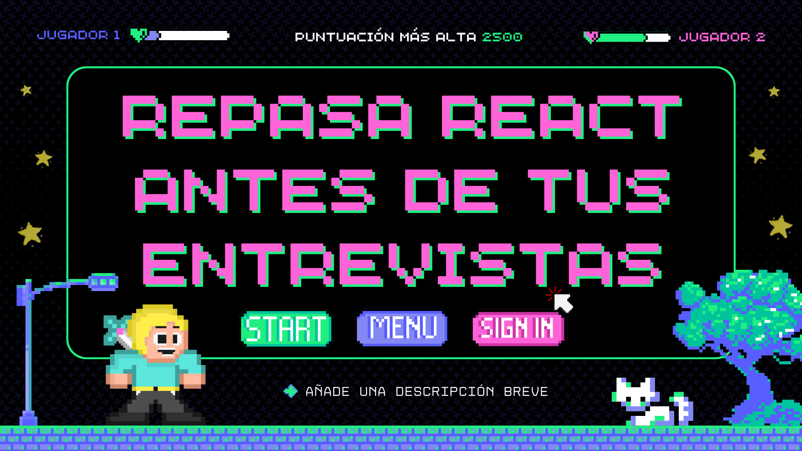

  
  <h1>Repaso para entrevista React Junior! 🤓</h1>

<i>45 preguntas con respuestas para que repases antes de tus entrevistas</i>

Dame una :star: si te sirvió ❤️

--- 
> *Las respuestas a las preguntas vienen principalmente de [scrimba](scrimba.com) y algunas respuestas inspiradas en [preguntas-entrevista-react](https://github.com/midudev/preguntas-entrevista-react) de [midudev](https://github.com/midudev/preguntas-entrevista-react/commits?author=midudev), gracias!*

---

## Índice

- [Índice](#índice)
  - [¿Qué es React?](#qué-es-react)
  - [¿Por qué usar React?](#por-qué-usar-react)
  - [¿Por qué es Composable?](#por-qué-es-composable)
  - [¿Por qué es Declarativo?](#por-qué-es-declarativo)
  - [¿Qué es un Componente?](#qué-es-un-componente)
  - [¿Qué es JSX?](#qué-es-jsx)
  - [¿Cómo se transforma el JSX?](#cómo-se-transforma-el-jsx)
  - [Diferencia entre componente y elemento en React](#diferencia-entre-componente-y-elemento)
  - [¿Cómo crear un componente en React?](#cómo-crear-un-componente-en-react)
  - [¿Qué son las props en React?](#qué-son-las-props-en-react)
  - [Prop children en React](#prop-children-en-react)
  - [¿Qué es un State en React?](#qué-es-un-state-en-react)
  - [¿Cuál es la diferencia entre Props y State?](#diferencia-entre-props-y-state)
  - [¿Cómo es el proceso de un State en React?](#proceso-de-state)
  - [¿Qué es el Conditional Rendering o Renderizado Condicional en React?](#qué-es-conditional-rendering)
  - [¿Cómo agregar clases a un componente en React?](#clases-en-componentes)
  - [Agregar clases a un componente de Forma condicional](#agregar-clases-de-forma-condicional)
  - [¿Cómo aplicar estilos (CSS) en React?](#estilos-css-en-react)
  - [¿Cómo se renderiza un array en React?](#cómo-se-renderiza-un-array-en-react)
  - [¿Cómo funcionan los event listeners en React?](#event-listener-en-react)
  - [¿Qué son los Hooks en React?](#qué-son-los-hooks)
  - [¿Cómo funciona `useState`?](#cómo-funciona-useState)
  - [¿Cómo se modifica el state de un array?](#cómo-se-modifica-state-array)
  - [¿Cómo se modifica el state de un objeto?](#cómo-se-modifica-state-objeto)
  - [Valor inicial del state es una función](#valor-inicial-state-función)
  - [¿Cómo se pasan States entre diferentes componentes?](#state-entre-diferentes-componentes)
  - [¿Qué es `useEffect`?](#qué-es-useEffect)
  - [¿Cuándo NO usar `useEffect`?](#cuándo-no-usar-useEffect)
  - [¿Qué es una Clean Up Function?](#qué-es-clean-up-function)
  - [¿Cómo podemos ejecutar código cuando el componente se renderiza?](#cómo-podemos-ejecutar-código-cuando-el-componente-se-renderiza)
  - [¿Qué es Fragment?](#qué-es-fragment)
  - [¿Cómo se recomienda utilizar imagenes en React?](#imagenes-en-react)
  - [¿Para qué se utiliza el hook `useRef`?](#para-qué-se-utiliza-useRef)
  - [¿Cuál es la relación entre `useEffect` y `useRef`?](#relación-useEffect-useRef)
  - [¿Cómo inicializar un proyecto de React?](#inicializar-react)
  - [¿Cómo funcionan los Forms en React?](#cómo-funcionan-forms-react)
  - [¿Cómo funicionan los Forms en React 18?](#forms-react-18)
  - [¿Cómo funicionan los Forms en React 19?](#forms-react-19)
  - [¿Qué es React DOM?](#react-dom)
  - [¿Cuáles son las 3 fases del renderizado en React?](#fases-renderizado-react)
  - [¿Qué es un Overloaded Component?](#overloaded-component)
  - [¿Qué es Props Drilling?](#qué-es-prop-drilling)
  - [¿Qué soluciones existen para el Props Drilling?](#soluciones-prop-drilling)
  - [¿Qué es React Context?](#qué-es-react-content)
  - [¿Qué es Compound Component?](#qué-es-compound-component)
